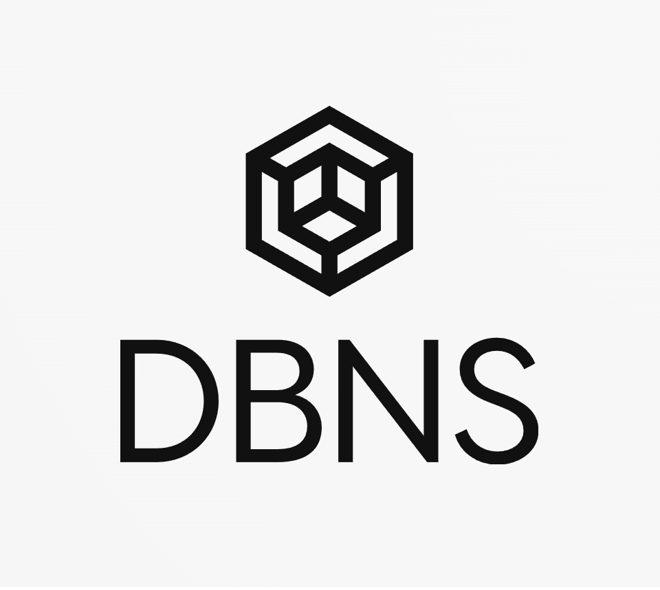

# Welcome to DBNS 🚀🧑‍🚀⚛
## A Submission for the Fileocin Data Economy Hackathon 2024.

  

## Description📜

### Database Namespaces Protocol (DBNS)

**DBNS** is a groundbreaking protocol designed to revolutionize data management and access control in decentralized environments. With a focus on Web3 technologies and integration with Filecoin Naming Service (FNS), Tableland, PushProtocol, Fleek, Lighthouse, DBNS aims to become the premier platform for data sharing, collaboration, and monetization in the decentralized web. Provides a structured and secure way to organize, share, and monetize datasets and associated codebases. Leveraging the power of IPFS and Filecoin networks, alongside advanced encryption techniques and smart contract capabilities, DBNS ensures data integrity, accessibility, and incentivized participation.

### Hosted on Fleek [DBNS website](https://dbns.on-fleek.app/#/)
### Key Features
- **Structured Namespace:** Users can create hierarchical namespaces under the root DBNS.fil, facilitating organization and categorization of datasets and codebases.

- **Access Control:** Datasets can be designated as PUBLIC, GROUPED-PUBLIC, PAID-GROUPED, or PAID-PRIVATE, allowing fine-grained control over data access and curation.

- **Encryption:** Utilizes Lighthouse's encryption SDK to secure IPNS records, ensuring that only authorized curators can decrypt and modify dataset contents and associated code.

- **IPFS/Filecoin** Integration: All data and code are stored on the IPFS and Filecoin networks, providing decentralized storage and immutable data integrity.

- **Tableland Protocol:** Utilizes Tableland protocol for SQL indexing within smart contracts, enhancing data searchability and query efficiency.

- **Push Protocol:** Integrated push protocol supports access-control-based chats, enabling seamless communication between curators and subscribers within the platform.

- **Incentivization Mechanism:** Active users and subscribers are rewarded with DBNS tokens, encouraging engagement and contributions to the platform.

### 🧑‍💻 Acknowledgments & Technologies Used 🤖
We would like to thank the following individuals and organizations for their contributions and support in developing DBNS:

- LIGHTHOUSE(IPNS - IPFS - FILECOIN) 🔓
  - Storing and Encrypting Data on IPFS&Filecoin using the RAAS service. [code](https://github.com/nijoe1/DBNS/blob/main/app/utils/IPFS.js)
  - Making IPNS support multiple access to update records by encrypting and storing the Private key on tableland giving access only to dataset and code curators.
- Filecoin Naming Service (FNS) 🔮
  - Creating a graph of unified categories using FNS subnames [code](https://github.com/nijoe1/DBNS/blob/main/contracts/contracts/libraries/FNS.sol)
- Tableland Protocol 🕸️
  - Tableland Queries [code](https://github.com/nijoe1/DBNS/blob/main/app/utils/tableland.js)
- Push Protocol 🌐
  - A token gated discussions to power efficient and private communication to dataset and models curators [usePush code](https://github.com/nijoe1/DBNS/blob/main/app/hooks/usePush.tsx) - [tokenGatingRules code](https://github.com/nijoe1/DBNS/blob/main/app/constants/push.js) - [groupCreation code](https://github.com/nijoe1/DBNS/blob/56971dc4cd50fd79ba064e78005163c85d83061e/app/components/contracts/createInstanceCode.js#L71)
- Fleek 🚀
  - Hosting the protocol website on IPFS for availability and speed! [DBNS website](https://dbns.on-fleek.app/#/)

---

## Smart Contracts

- [Link to Filfox Calibration](https://calibration.filfox.info/en/address/0x5d97aD0083CaEB3741FAeA63cb701Db6003CEd04)

- [DBNS Contract](https://github.com/nijoe1/DBNS/blob/main/contracts/contracts/DBNS.sol)

- [Tableland Integration Contract](https://github.com/nijoe1/DBNS/blob/main/contracts/contracts/libraries/Tableland.sol)

- [FNS Integration Contract](https://github.com/nijoe1/DBNS/blob/main/contracts/contracts/libraries/FNS.sol)

**Authors:**

- [nijoe1](https://github.com/nijoe1)

